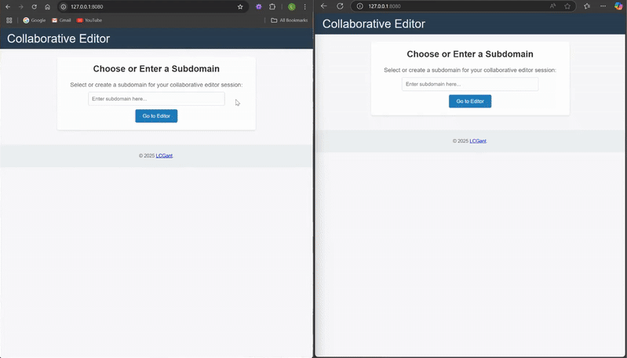

# Collaborative Editor

The **Collaborative Editor** project is a web-based text editor built with **Go (Golang)**, using the **Gin** framework for web routing, **GORM** for database interactions, and an interactive front end using HTML, CSS and JavaScript. This editor allows multiple users to collaboratively edit HTML pages in real time, with conflict management and instant notification.

**Note:** If you plan to deploy this project in a production environment, ensure the following security measures are implemented:

- **XSRF/CSRF Protection:** Prevent cross-site request forgery attacks by implementing robust token-based protection mechanisms.
- **Secure Cookie Handling:** Use attributes like `HttpOnly`, `Secure`, and `SameSite` to protect cookies from being accessed or transmitted in an insecure manner.
- **TLS/HTTPS:** Enable HTTPS to ensure encrypted communication between the server and clients.
- **Environment Variables:** Store sensitive information, such as database credentials, in environment variables instead of hardcoding them in the source code.
- **WebSocket Security:** Review and test WebSocket communications to identify and address potential vulnerabilities.


## ⚙️ Technologies Used

- **Go (Golang)**: Primary programming language.
- **Gin**: Lightweight web framework for Go.
- **GORM**: ORM for MySQL database interactions.
- **Gorilla WebSocket**: Library for WebSocket communication in Go.
- **MySQL**: Relational database for data persistence.
- **HTML/CSS/JavaScript**: Frontend technologies for the application.
- **WebSockets**: For real-time communication between clients and the server.


## 📹 Showcase



Watch the Collaborative Editor in action! This GIF demonstrates real-time collaborative editing, conflict management, and instant notifications as multiple users work together on the same HTML page.

## 🛠️ Prerequisites

Before starting, ensure you have the following installed:

1. **Go** (version 1.18 or higher)
   - [Download Go](https://golang.org/dl/)
2. **MySQL** (or another compatible database)
   - [Download MySQL](https://www.mysql.com/downloads/)
3. **Git** (for version control)
   - [Download Git](https://git-scm.com/)

## 🗄️ Database Setup

1. Start MySQL on your local environment.
   
2. Create a database named `collaborativeeditor` by running:
   ```sql
   DROP TABLE IF EXISTS `pages`;
   CREATE TABLE `pages` (
     `ID` int(11) NOT NULL AUTO_INCREMENT,
     `file_name` varchar(255) NOT NULL,
     `content` mediumtext DEFAULT NULL,
     `Created_at` timestamp NOT NULL DEFAULT current_timestamp(),
     `Updated_at` timestamp NOT NULL DEFAULT current_timestamp() ON UPDATE current_timestamp(),
     `parent_id` int(11) DEFAULT NULL,
     `Level` int(11) NOT NULL,
     PRIMARY KEY (`ID`),
     UNIQUE KEY `unique_file_name_parent` (`file_name`,`parent_id`,`Level`),
     KEY `parent_id` (`parent_id`),
     CONSTRAINT `pages_ibfk_1` FOREIGN KEY (`parent_id`) REFERENCES `pages` (`ID`) ON DELETE CASCADE
   ) ENGINE=InnoDB DEFAULT CHARSET=utf8mb4 COLLATE=utf8mb4_general_ci;
   ```
   
3. Configure the database credentials in the `main.go` file (DSN).

## 🚀 Installation and Execution

1. Clone the repository:
   ```bash
   git clone https://github.com/LCGant/collaborativeeditor.git
   cd collaborativeeditor
   ```
2. Install dependencies:
   ```bash
   go mod tidy
   ```
3. Run the application:
   ```bash
   go run main.go
   ```
4. Access the application at: [http://127.0.0.1:8080](http://127.0.0.1:8080)

## 📁 Project Structure

- `main.go`: Main file to start the server.
- `controllers/`: Contains controllers for server routes.
- `models/`: Defines data models for GORM.
- `services/`: Contains business logic and utilities for the project.
- `static/`: Static files (CSS, JS, images).

## 📜 License

This project is licensed under the MIT License. See the [LICENSE](LICENSE)

